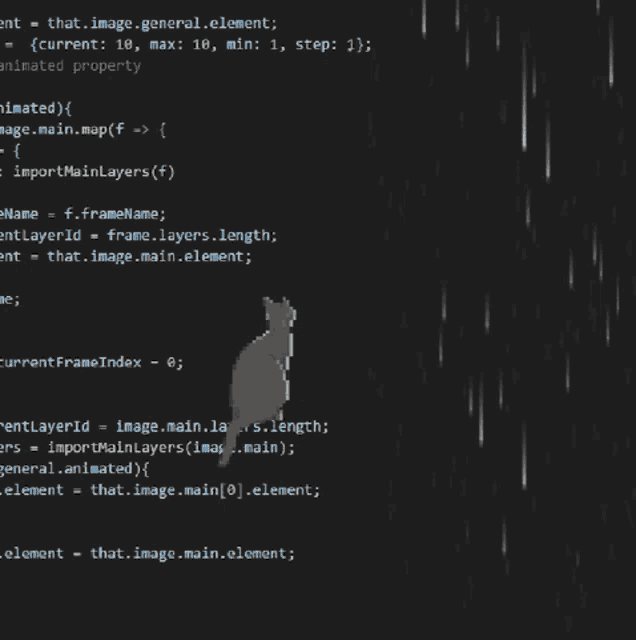

<table>
<tr>

<td width="60%" valign="middle">

# Olá! Sou Selena Lory 👋

- 🎓 Estudante de Engenharia de Software
- 🌱 Aprendendo **C, HTML, CSS, JavaScript, Git e GitHub**
- 💻 Construindo meu portfólio e projetos práticos
- 🚀 Em busca da minha primeira oportunidade em tecnologia

</td>

<td width="40%" align="center" valign="middle">

</td>

</tr>
</table>

 

  

  

